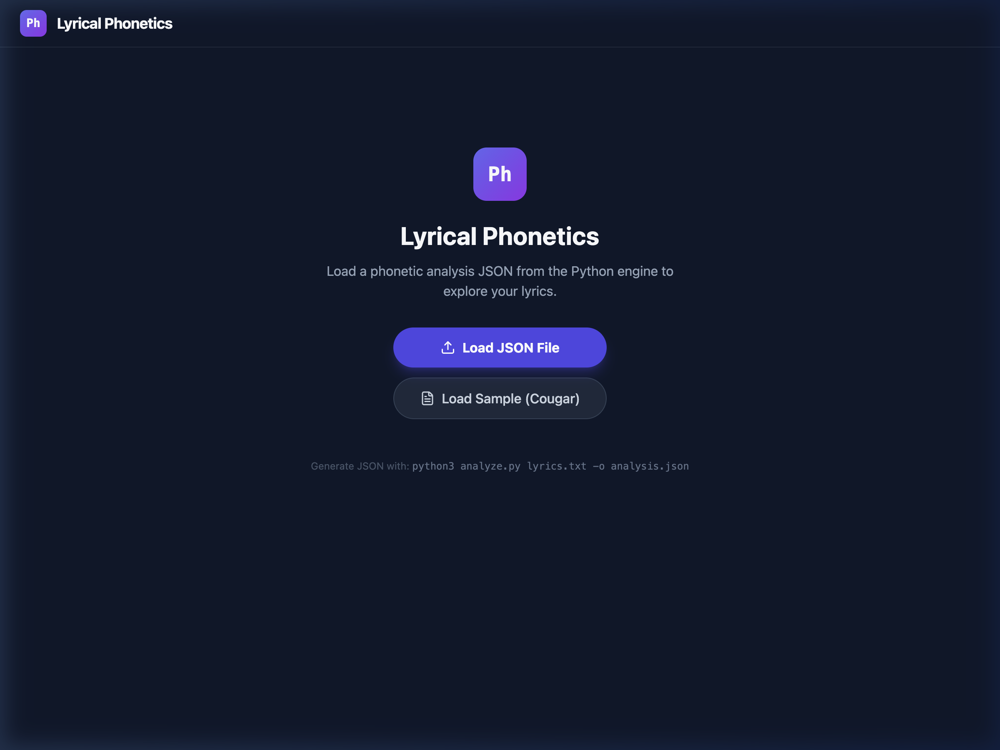

<div align="center">

# 🎵 Lyrical Phonetics

**See the sonic architecture of your songs.**

A tool for songwriters, poets, and lyricists that reveals the hidden phonetic scaffolding in your writing — rhymes, assonance, alliteration, consonance, and more — through an interactive, color-coded visualization.



</div>

---

## What It Does

Paste your lyrics in (or feed it a `.txt` file), and Lyrical Phonetics will:

- 🔍 **Detect rhymes** — end rhymes, internal rhymes, slant rhymes
- 🎨 **Map assonance** — recurring vowel sounds across lines
- 🔗 **Find alliteration & consonance** — consonant patterns and clusters
- 📊 **Measure sonic density** — how "loaded" each line is with sound devices
- 🎯 **Identify anaphora** — repeated phrase openings
- 🌊 **Trace cascades** — vowel/consonant patterns that flow across lines

The visualizer lets you toggle each device on/off, see connections highlighted in your lyrics, and switch between **Manuscript**, **X-Ray**, and **Workshop** views.

---

## Three Ways to Use It

### 1. 🖥️ Desktop App (macOS) — Easiest

Download the `.dmg` from [Releases](../../releases), open the app, and paste your lyrics. That's it. No Python, no terminal, no setup.

> The app bundles everything — Python engine, web visualizer, and all dependencies — into a single package.

### 2. 🐍 Python CLI — For Power Users

Run the analysis engine directly from the command line:

```bash
cd python
pip install -r requirements.txt
python3 -m spacy download en_core_web_sm

# Analyze a lyrics file
python3 analyze.py lyrics.txt -o analysis.json

# Or use a different format
python3 analyze.py lyrics.txt --format text
```

This produces a structured JSON file you can load into the web visualizer, pipe into other tools, or use however you like.

### 3. 🌐 Web Visualizer — Cross-Platform

If you're on Windows or Linux (or prefer a browser), run the development server:

```bash
npm install
npm run dev
```

Then open `http://localhost:3000`, load a JSON file from the Python CLI, and explore.

---

## Project Structure

```
lyrical-phonetics/
├── python/
│   ├── phonetic_engine.py     # Core analysis engine (the brains)
│   ├── analyze.py             # Standalone CLI tool
│   ├── server.py              # Flask API (used by the desktop app)
│   ├── test_phonetic_engine.py
│   ├── requirements.txt       # Core deps: nltk, pronouncing, spacy
│   └── requirements-app.txt   # App deps: adds flask, pyinstaller
├── App.tsx                    # React frontend
├── components/                # UI components (ManuscriptView, XRayView, etc.)
├── electron/                  # Desktop app shell
│   ├── main.js                # Electron main process
│   └── preload.js             # Security bridge
├── build/
│   ├── build_python.sh        # Bundle Python with PyInstaller
│   └── build_app.sh           # Full app build (Vite + Python + Electron)
└── output_examples/           # Sample analysis files to try
```

### Module Architecture

The project is modular by design:

- **`phonetic_engine.py`** is the core library — import it from anywhere
- **`analyze.py`** is a standalone CLI that uses the engine — no web dependencies
- **`server.py`** is a Flask wrapper around the engine — used by the desktop app only
- **The React frontend** is a pure visualizer — it reads JSON, that's it
- **The Electron shell** just wraps the frontend + backend into a `.app`

Each layer can be used independently.

---

## Building the Desktop App

To build the macOS `.app` yourself (requires Python 3.12+, Node.js 18+):

```bash
# Install Python dependencies
cd python && pip install -r requirements-app.txt && cd ..
python3 -m spacy download en_core_web_sm

# Install Node dependencies
npm install

# Build everything (Vite → PyInstaller → Electron)
bash build/build_app.sh
```

The DMG will appear in `dist-electron/`. 

> **Note:** The app is ~200 MB because it bundles a full Python runtime + spaCy model. We exclude heavy unused libraries (PyTorch, SciPy, etc.) to keep it as small as possible.

---

## Sonic Devices Detected

| Device | What It Finds | Example |
|--------|--------------|---------|
| **Rhyme** | End rhymes, internal rhymes, slant rhymes | *cat* / *hat*, *time* / *rhyme* |
| **Assonance** | Repeated vowel sounds | *r**ai**n* / *d**ay*** / *f**a**ce* |
| **Alliteration** | Repeated initial consonants | ***s**ilent **s**ea **s**hore* |
| **Consonance** | Repeated consonant sounds anywhere | *lu**ck** / ba**ck** / de**ck*** |
| **Anaphora** | Repeated phrase starts | *I have a dream... I have a dream...* |
| **Cascade** | Vowel/consonant patterns flowing across lines | Progressive sound shifts |

---

## Examples

The `output_examples/` folder contains sample analyses you can load into the visualizer to see what the tool does before running it on your own work.

---

## License

MIT

---

<div align="center">

*Built for songwriters who care about the sounds between the words.*

</div>
